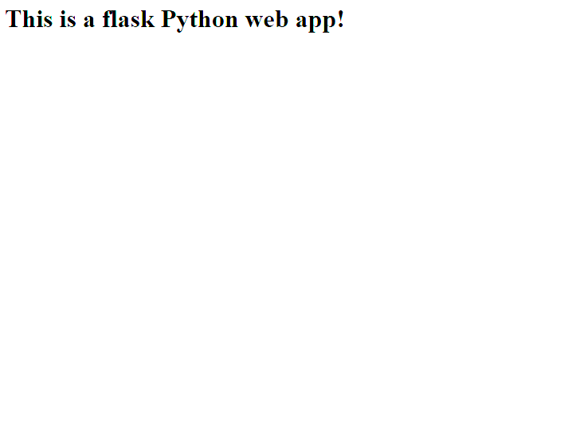

## Create and roll out a Azure Container App 
This demo is based on a demo video from [MadeForCloud](https://www.youtube.com/watch?v=eYUsR4j7-kA)

### Setup a virtual python environment: 
> python -m venv .venv  
> .venv\scripts\activate  
> pip install -r requirements.txt  

### Run the instance locally with:
>python -m flask run --debug --host=localhost --port=80  

### Prepare the infra using the scripts in the infra folder
> Container App Environment: aca.ps1  
> Container Registry: container-registry.ps1

### Build the image locally
>docker build --pull --rm -f ".\Dockerfile" -t container-app-demo:latest "."

### Tag the image
>docker tag container-app-demo mybesttoolstestacr01.azurecr.io/container-app-demo:v1

### Push the image to your container library
>docker push mybesttoolstestacr01.azurecr.io/container-app-demo:v1

